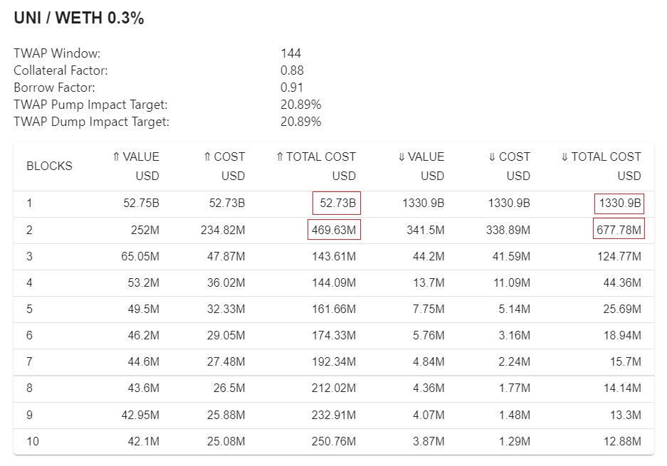

# 返済

### About

ユーザーは、すでにEulerに預けられている既存の資産であるウォレット内の資産を使って、借りた資産を返済することができます。ユーザーは、借りた資産とは異なる預けた資産を使って返済する場合、資産を交換することができます。

### Step-by-step

<figure><figcaption></figcaption></figure>

1. ウォレットに十分な資金、預金があることを確認して返済してください。
2. 返済するEulerアカウントを選択します。
3. ウォレット残高で返済する場合は、負債資産（借入資産）を選択し、返済額を選択します。
4. Eule内の預金で返済する場合は、負債資産、返済額の順に選択します。
5. 続けて、返済に充てる対象資産と金額を選択します。
   * 必要に応じて、適切なスワップが外部取引所で行われます。スワップ パラメータをカスタマイズするには、右上の歯車アイコンを使用します。
6. `Max`を選択すると、ローンを全額（またはウォレット残高/Eulerの預金に基づく最大可能額）返済することができます。
7. スワップが必要な場合は、見積もりを待って、`Swap and Repay`ボタンをクリックします。

### FAQ

**別の資産でローンを返済することはできますか？**\
はい。ユーザーのウォレットまたはEulerの預金から、融資された資産とスワップされ返済されます。
